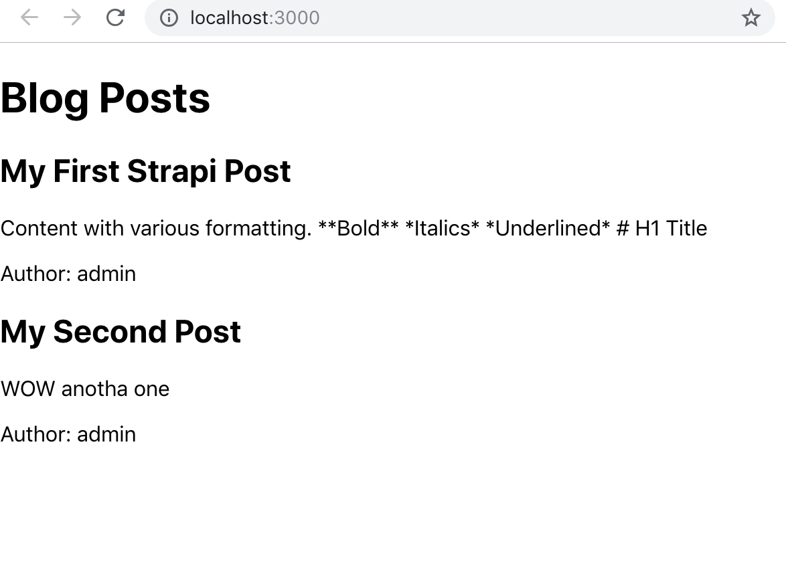

# Creating my first Strapi.io site

## Installing

They have a pretty simple guide to install Strapi right here: [https://strapi.io/getting-started](https://strapi.io/getting-started). I suggest following that for installing, it's very easy and I already had everything I needed, just Node JS and MongoDB.

You just install strapi globally `npm install strapi@alpha -g` then use `strapi new <name>` to create your project. I named mine myFirstStrapi because it is in fact my first Strapi. I chose MongoDB for the database and used the default values, just spam enter like you do for `npm init` when you forget the `-y`.

**Pro Tip:** By default MongoDB doesn't use a username and password. The user/pass when using `strapi new projectName` is the access to MongoDB not for the project. Don't set these fields if you haven't set one for mongo as it will cause an authentication error.

## Starting Up

When you first launch the app you create the initial login, then it takes you to the interface. **It was love at first site (sight).** What a beautiful interface, I have spent so much time in Wordpress and it's ugly UI that this just put a smile on my face. I love this UI.


The first page you see has a link to a getting started guide on their documentation. Pretty standard. Left side bar is how you navigate to each section just like wordpress.

A very very very nice UI.

## Things I Noticed First

There is a lot of easy to use controls for the environment. You have three defined environments in settings: Development, Production, and Staging. You can easily control individual settings for these in the configurations tab.

<p float="left" align='middle'>


</p>

Everything is super clean and simple. Wanna add a new content type? Use the builder and do it in no time. Managing users, roles, permissions, files, everything is just so intuitive and simple. I am very impressed.


Adding a new content type is literally as easy as using a form builder.


## Implementing Front End

I chose to use React for the front end as it's modern and also the same framework Strapi's admin panel is built in. I also have more experience in React than other frameworks.

I started with create-react-app, because this is a test project and it just makes life easier.

To get started I made a content type called post that has a title, content, and a relation to a user. I then had to allow the public users to be able to access the data from the api because I'm not adding any authentication to my react app for now.


I made a react component to fetch the posts and display them. It was super simple and I used axios for the get request. To test I created two post entries. I have not added any markdown processing yet but it's worth noting the text editor in Strapi's admin panel uses markdown when you use it's format buttons. It's also worth noting you can do more than just get data, you can post data to the server and much more.



Here's the code for my component, I messed up naming the fields a bit so two of them have a capital letter which works but doesn't look right, for now it's fine.

```javascript
import React, { Component } from 'react'
import axios from 'axios'
import './BlogPosts.css'
class BlogPosts extends Component {
  constructor() {
    super()
    this.state = {
      posts: []
    }
  }
  componentDidMount() {
    axios.get('http://localhost:1337/posts').then(res => {
      console.log(res.data)
      this.setState({
        posts: res.data
      })
    })
  }
  render() {
    let posts = this.state.posts.map((post, i) => {
      return (
        <div className="post" key={i}>
          <h2>{post.Title}</h2>
          <p>{post.Content}</p>
          <p>Author: {post.user.username}</p>
        </div>
      )
    })
    return (
      <div>
        <h1>Blog Posts</h1>
        {posts}
      </div>
    )
  }
}

export default BlogPosts
```

See, simple as that.

## Future Ideas

Some sort of markdown processing is a must add.

I plan to build my own front end for creating, modifying, and deleting content. This will make it easy for the users and I can also tweak it how I like. I will need to add authentication, I think JWTs will work just fine.

I may play with some static site generators such as [Gatsby](https://www.gatsbyjs.org/) to try and blow your mind with performance.

## Closing

That's all for now.

I strongly encourage you checkout [Strapi](https://strapi.io) and give it a shot. Check [their documentation](https://strapi.io//documentation/) to see all the possibilites. You can really have full control with a great UI. You can even build your own UI if you want, everything is so easy to customize. I think this is something I am going to use for many new projects.
